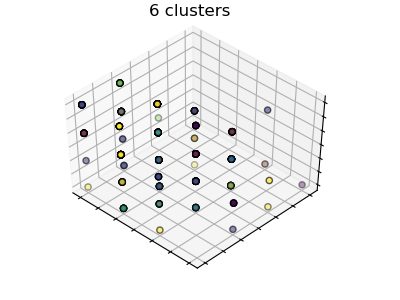

# Skin-Lesion-Classifer
Dataset sourced by Professor James Hughes - University of Western Ontario

Background:

The dataset I choose for my analysis contains measured values for 35 attributes of skin samples taken from 366 patients. Columns 1-11 and 34 record clinical attributes concerning qualitative information about the skin lesion (e.g., Presence of scaling, definite borders, itching). Columns 12-33 are histopathological attributes such as melanin incontinence, spongiosis etc.,

      1: erythema
      2: scaling
      3: definite borders
      4: itching
      5: koebner phenomenon
      6: polygonal papules
      7: follicular papules
      8: oral mucosal involvement
      9: knee and elbow involvement
     10: scalp involvement
     11: family history, (0 or 1)
     34: Age (linear)

     Histopathological Attributes: (take values 0, 1, 2, 3)
     12: melanin incontinence
     13: eosinophils in the infiltrate
     14: PNL infiltrate
     15: fibrosis of the papillary dermis
     16: exocytosis
     17: acanthosis
     18: hyperkeratosis
     19: parakeratosis
     20: clubbing of the rete ridges
     21: elongation of the rete ridges
     22: thinning of the suprapapillary epidermis
     23: spongiform pustule
     24: munro microabcess
     25: focal hypergranulosis
     26: disappearance of the granular layer
     27: vacuolisation and damage of basal layer
     28: spongiosis
     29: saw-tooth appearance of retes
     30: follicular horn plug
     31: perifollicular parakeratosis
     32: inflammatory monoluclear inflitrate
     33: band-like infiltrate

All attributes, with the exception of age and family history (1-present, 0-not present), assume values from 0-3 with 0 indicating the feature was not present to 3 indicating the maximum amount possible present. 

The 35th column provides a classification of the skin lesion into one of 6 types of skin disease:

`
Class code          Class  
`  

       1             psoriasis  
       
       2             seboreic dermatitis  
       
       3             lichen planus  
       
       4             pityriasis rosea  
       
       5             cronic dermatitis  
       
       6             pityriasis rubra pilaris
`

8 data rows were omitted in final analysis on the basis of missing data points. This created a (358,35) matrix.

Dataset rationale:

One of the aims of the authors of this dataset was to find clearer distinctions in the classification of 
erythemato-squamous skin lesions. Many lesions under this umbrella category look identical and are difficult to diagnose even with histopathology. This provides interesting point of intervention for machine learning to use empirical data and classification algorithms to aid in differential diagnosis. 

Visualizations:

The first visualization employed is a box plot. Data from one column is separated 
by skin lesion type into separate boxes:

Individuals with seboreic dermatitis (code 2) appear to show a greater degree of histological attribute of 
eosinophils in the infiltrate compared to patients with other skin lesion types.

The second visualization was a histogram that plots data for one feature. This allowed us to be able to compare the relative incidences of each of the 6 skin lesion types within the data:

The graph clearly shows the majority of patients in the dataset have been diagnosed with psoriasis and the lowest diagnoses being pityriasis rubra pilaris.

The majority of patients also do not have a family history of the disease: 

Machine learning:

The first machine learning approach I used was a standard supervised approach to classify the data set,
using the skin lesions codes (column 34) as labels and remaining columns as features. Using the K-nearest neighbors classifier, the dataset was split into a train and test sets. The algorithm was fitted to the training set and scored and tested on the test set. The results of the scores are fairly good:

`
In []: learn1(patients)  
`  
`
[5 4 4 1 6 1 2 1 3 5 1 4 3 1 1 1 1 3 3 4 3 1 1 4 6 4 1 4 1 1 1 4 5 1 3 4 5
 1 1 3 2 1 3 5 4 1 2 2 3 2 4 6 3 2 3 5 1 2 1 3 4 3 3 2 2 1 5 5 2 4 2 5 1 5
 1 4 2 3 2 2 4 3 4 2 4 6 1 3 3 1 2 2 6 3 3 1 1 4 5 1 4 6 5 2 4 5 4 1 4 1 1
 3 5 3 1 2 3 5 3]  
 `  
 `
Out[]: 0.87394957983193278
`

This machine learning approach is therefore fairly reliable on classifying new patients providing data on the select 34 features into one of the 6 skin lesion types. It performs this by plotting the 2D patient vector on a plane relative to the vectors of the other patients and classifying it based on the values of the nearest patients in space.

The second machine learning approach implemented was an unsupervised a k-mean clustering approach.
The results of this method revealed 6 clusters grouped along the x-axis:

`
In []: learn2(patients)  
`  
`
[3 2 5 1 1 1 5 3 5 0 5 5 5 2 4 1 0 0 5 5 2 3 1 1 5 0 2 5 1 3 3 2 0 2 5 1 3
 4 2 0 0 3 1 2 3 4 0 0 1 3 3 5 5 0 5 0 2 1 0 1 0 4 0 5 1 5 0 2 3 3 5 5 0 4
 3 5 1 0 5 2 3 0 1 3 5 0 3 1 0 1 5 5 0 4 5 2 5 4 1 5 0 1 4 0 1 0 1 5 1 1 1
 2 5 3 5 2 0 1 2 0 0 5 2 1 5 2 3 1 0 0 0 5 4 0 1 0 5 5 4 5 0 1 3 5 0 1 0 5
 1 3 5 1 3 0 0 1 0 4 5 2 5 3 4 3 5 5 1 3 3 5 1 0 0 1 1 0 5 3 4 5 2 0 5 3 3
 5 3 1 5 5 0 5 3 3 0 1 5 5 3 0 1 3 5 4 0 5 3 4 5 0 3 5 3 1 1 0 0 1 5 5 0 1
 0 5 3 1 0 1 3 4 4 1 0 3 4 2 2 5 4 3 0 5 3 4 5 3 1 4 0 5 1 3 0 5 4 5 0 0 2
 2 2 0 4 3 0 3 4 0 5 5 2 3 3 5 3 5 4 5 1 1 5 0 5 1 5 3 0 2 5 0 4 3 5 0 3 0
 5 5 5 3 2 1 3 0 5 5 0 3 3 1 3 4 5 0 5 4 3 1 0 3 5 1 0 5 1 0 4 3 4 1 0 3 0
 4 3 2 2 0 1 5 2 2 5 2 3 1 3 0 4 1 5 1 5 5 0 5 3 0]
`

There doesn't appear to be a pattern/structure to the feature vectors such that lesion type can be definitively determined. This may mean that the clinicians are examining lesion attributes with too weak a correlation to oneanother, and to each lesion type to reveal any structure within the data. 

